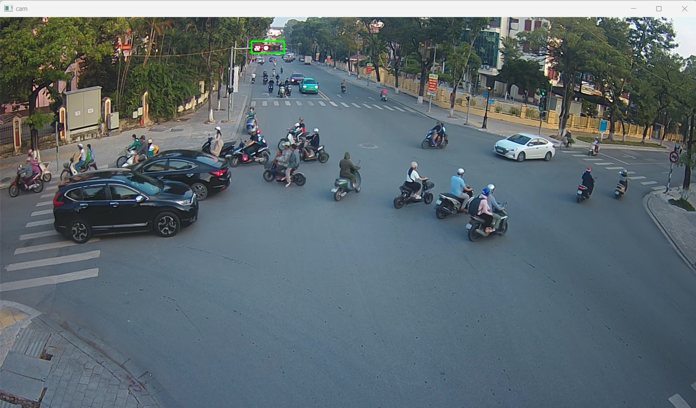
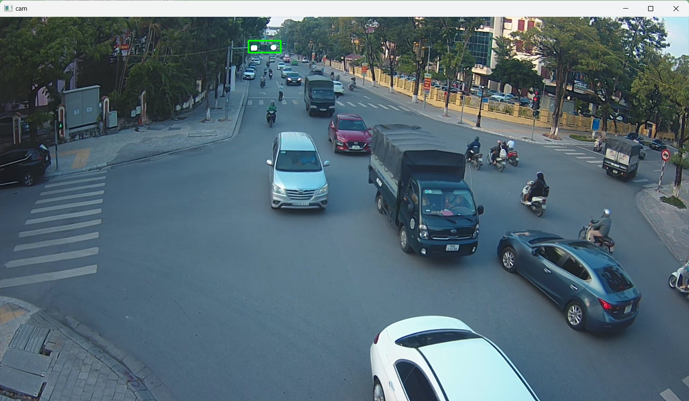
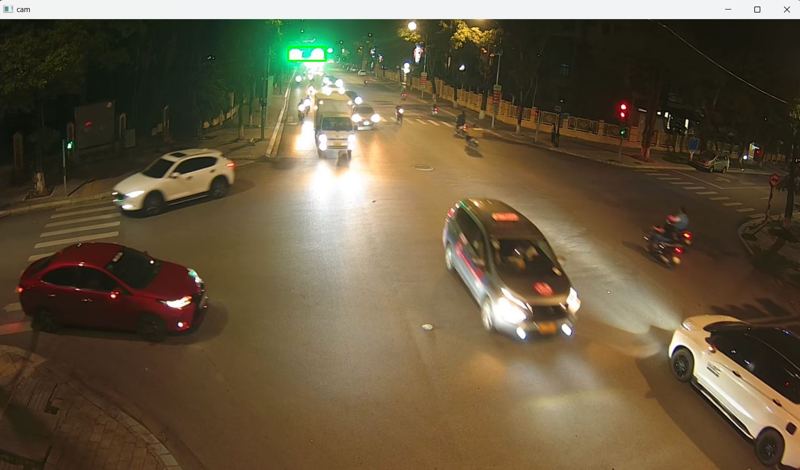

# Sử dụng Machine Learning trong việc phân biệt màu sắc của đèn báo giao thông

Trong cuộc sống hàng ngày, đèn báo giao thông đóng vai trò quan trọng trong việc
duy trì an toàn và thông suốt của giao thông đường bộ. Trong nỗ lực tối ưu hóa hệ
thống này, chúng ta sử dụng sự sáng tạo bằng cách áp dụng các thuật toán cơ bản như
Decision Tree, SVM, AdaBoost và Gradient Boost để phân loại màu sắc của các đèn
báo.

Bằng việc tận dụng xử lý ảnh để trích xuất thông tin từ hình ảnh của đèn báo giao
thông, và sau đó sử dụng các thuật toán này để phân loại màu sắc một cách đáng tin
cậy. Kết quả của nghiên cứu này không chỉ mang lại khả năng cải thiện quản lý giao
thông mà còn góp phần đảm bảo tính liên tục của luồng giao thông trên đường phố,
mà còn thể hiện sự sáng tạo của con người thông qua việc ứng dụng các phương pháp
cơ bản vào cuộc sống hàng ngày.

